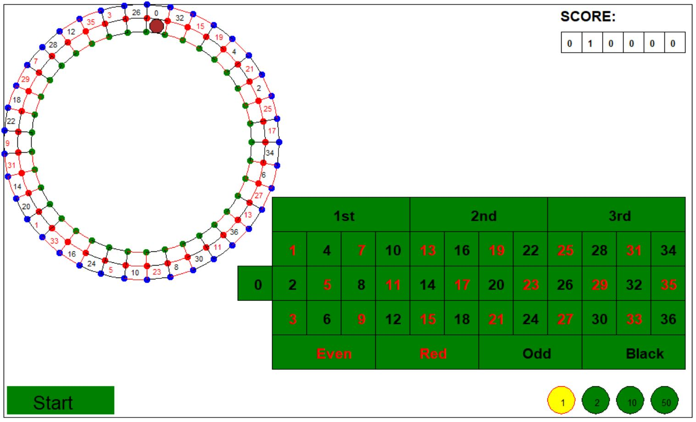

Casino - Roulette
=================

A simple game written in Python Turtle.  

## Description
In Roulette game, players may choose to place bets on either a single number, various groupings of numbers, the colors red or black, whether the number is odd or even.

## Operation 
- Click on the lower right corner to choose bet chips, "1", "2", "10" or "50" 
- Chick on the table to place bets, at least one chip is needed
- Click on the lower left corner to "Start" or "New Round"

**Note: only green areas are clickable!**